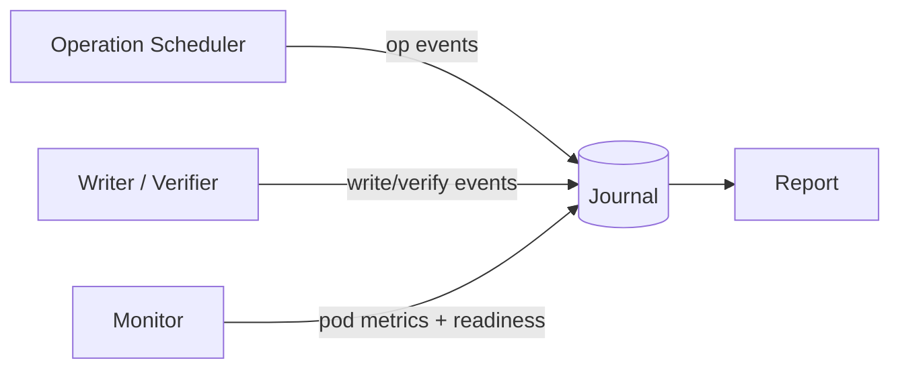

# Long Haul Test Design

**Issue:** [#220](https://github.com/documentdb/documentdb-kubernetes-operator/issues/220)

---

## Terminology

- **DocumentDB cluster** — the database cluster managed by the operator (the `DocumentDB` CR and its pods).
- **Kubernetes cluster** — the infrastructure cluster where the operator and DocumentDB run.

When unqualified, "cluster" refers to the **DocumentDB cluster**.

---

## Problem Statement

E2E tests run for 15–60 minutes from a clean state. They cannot detect bugs whose **accumulation rate is tied to real operations** — memory leaks, lock-table bloat, CR-history drift, upgrade-under-state failures. These bugs surface only after days of continuous operation.

You can't speed up "memory leaked per reconciliation cycle" — you need many real reconciliation cycles. The long-haul infrastructure (persistent cluster, event journal, alerting) exists because these tests can't be attended, can't be reset between runs, and need accumulation that no existing test type provides.

---

## Architecture

### Components

The driver is a single Go binary that runs five long-lived components against an externally-provisioned DocumentDB cluster. Boxes are components; arrows are events written to the journal.

| Component | Role | Output |
|---|---|---|
| **Writer/Verifier** | Data-plane workload. Connects via `mongodb://` only — no k8s imports. Writers insert monotonic sequences with checksums under majority write concern; verifiers scan for gaps and bad checksums. | Counters (acked, failed, verify passes, gaps, checksum errors); errors to journal. |
| **Operation Runner** | Control plane. Applies weighted-random ops for production long-haul runs, a deterministic named sequence for smoke/reproduction, or no ops when disabled. | Bounded per-operation results/aggregates plus operation events to journal. |
| **Monitor** | Polls pod RSS/CPU and checks readiness of operator + DB pods. | Periodic samples + readiness events to journal. |
| **Journal** | In-process append-only event log shared by all components. | Reproducible event stream for the report. |
| **Report** | Aggregates the journal into a markdown summary at a configurable interval; raises alerts on threshold breaches. | Markdown report; alert lines. |

**Code reuse.** Where possible, the driver consumes the same helpers as the e2e suite — the Mongo client, DocumentDB lifecycle operations (create / patch / wait-healthy / delete), and TLS plumbing all live in a shared `test/shared` Go module. This keeps long-haul behavior aligned with what e2e exercises and avoids two diverging mongo-driver wrappers.

### Cluster Topology

The driver supports a **two-cluster** topology so signals become attributable: a **Primary** cluster the scheduler operates on, and a **Baseline** cluster the scheduler leaves alone. Both clusters receive the same data-plane traffic so they form a fair comparison.

| Observation | Diagnosis |
|---|---|
| Primary degrades, Baseline stable | Per-cluster bug — caused by operations on Primary |
| Both degrade | Operator-level bug — leak in the shared operator |
| Baseline degrades, Primary stable | Infrastructure noise — dismiss |

**Realistic cluster configuration.** Both clusters are deployed with production-style settings: `podAntiAffinity` (one replica per node) and a `PodDisruptionBudget` that keeps a majority of replicas available during voluntary disruptions. Without these, chaos and upgrade operations would surface misconfiguration failures (e.g. quorum lost because all replicas landed on the drained node) instead of the operator/DB bugs we are trying to catch.

---

## Lifecycle

The test runs **continuously** — no cycles, no scheduled resets. Workload, metrics, operations, and health monitoring all run as long-lived processes. The system accumulates real state (PVC growth, CR history, operator memory) exactly as it would in production. The cluster is only re-provisioned manually after a Fatal failure (see Failure Tiers).

**Workload runs through upgrades.** Both operator and DocumentDB upgrades fire while the workload is live — no drain, no quiesce. Draining before upgrade hides exactly the upgrade-under-state bugs we're testing. Downgrades are not exercised because neither path is a supported product transition.

**Baseline gate before upgrades.** Upgrades are triggered by the operator release workflow, but don't fire immediately. The harness enforces a minimum accumulation period (default 48h) since the last upgrade — ensuring we always test "upgrade after accumulated state". If multiple versions arrive while the gate is closed, only the latest executes.

---

## Operations

Production runs use weighted randomization. Deterministic smoke and reproduction
runs can instead request a comma-separated sequence of stable operation names;
each operation runs exactly once in order and the driver exits as soon as the
sequence completes or fails. A disabled mode leaves the workload running without
management operations.

| Category | Examples |
|---|---|
| **Topology** | scale up, scale down (within CRD bounds for `spec.instancesPerNode`) |
| **Lifecycle** | DocumentDB version upgrade, operator upgrade |
| **HA** | controlled failover |
| **Chaos** | kill primary pod, drain node, kill operator pod |
| **Data protection** | trigger backup, verify backup |

**Operation invariants** (exact values live in code):

- One disruptive op at a time in every mode. Overlapping disruptions are
  non-diagnosable.
- Random mode applies the global cooldown between attempts.
- The steady-state gate must pass before each operation. Sequence mode also
  requires each named precondition to become true within the recovery timeout.

**Backup is not isolated.** It runs concurrently with topology changes and chaos so that backup-vs-topology serialization bugs surface here rather than in production — that serialization is the backup feature's job, not the harness's.

Each operation declares an **outage policy**: tolerated write failures during its disruption window and a max recovery time. Breaching the policy is recorded as a Tier-1 failure (see Failure Tiers).

### Outage budgets

Budgets are wall-clock write-outage durations, independent of the writer count; the longer whole-topology restart is bounded separately by the recovery timeout.

- **Scale up / down and `kill-operator-pod`** keep the primary write path up throughout, so they are held to a **near-zero** write-outage budget — a regression that unexpectedly disrupts writes during a "safe" operation is caught.
- **`kill-primary-pod`** tolerates a short outage for a single automatic failover (~30s).
- **`upgrade-documentdb`** tolerates a larger one (~90s): a cross-version rolling upgrade's primary switchover coincides with the extension migration under live write load.

Exact values live in code (`test/longhaul/journal/policy.go`).

### HA preconditions

`upgrade-documentdb` and `kill-primary-pod` require an HA topology (`spec.instancesPerNode >= 2`): with no standby to absorb writes, the disruption would produce real (true-positive) downtime that no operator change can prevent. The two runners handle an unmet precondition differently: **random** mode **auto-skips** (the skip consumes no cooldown and is re-evaluated on the next scheduler tick, so scaling up makes the operation eligible again), whereas **sequence** mode does not skip — it waits for the precondition up to the recovery timeout and then fails the sequence, so an HA-dependent op must be preceded by a `scale-up` (or start at `instancesPerNode >= 2`).

Operation state is intentionally bounded for multi-day runs. Random mode keeps
only passed/failed counters per registered operation type; sequence mode keeps
one mutable `PENDING`/`RUNNING`/`PASSED`/`FAILED` result per requested item.
Execution errors, precondition timeouts, outage-policy violations, and an
incomplete sequence at shutdown all produce a failing final verdict.

**Sequence mode** (used by the PR smoke gate) runs the registered operations in
an explicit, fixed order (`LONGHAUL_OPERATION_SEQUENCE`), executing each exactly
once behind the same steady-state / precondition / recovery gates as random
mode, rather than selecting operations by weight for the full duration. This
gives the smoke gate a deterministic PASS/FAIL verdict — every sequenced
operation must reach `PASSED` and the run must reach `COMPLETE`; `MAX_DURATION`
becomes the completion watchdog, and a sequence that has not finished at shutdown
is a failing `INCOMPLETE` verdict.

---

## Data Plane Workload

The workload provides a **durability oracle** — every acknowledged write must be readable, in order, with the correct checksum, until the end of the run.

Key invariants:

- **Multiple writer goroutines**, each with a unique `writer_id`, write monotonic `seq` values with payload checksums.
- **Majority write concern.** A write is only counted as acknowledged after replication to a majority of replicas.
- **Verifier scans** the collection periodically and flags any gap in `seq` per writer or any checksum mismatch on read-back.
- **Majority read concern** to avoid false negatives from replica lag.
- **Deployment-blind.** The workload imports no Kubernetes libraries, so the same binary runs against any cluster (AKS, EKS, GKE, kind).

Losing an acknowledged write or observing a checksum mismatch is a Tier-1 failure regardless of what else is happening.

---

## Backup Verification

When enabled, the driver maintains a canary `ScheduledBackup` named `<cluster>-longhaul` (reconciled in place, never recreated, so history survives restarts and parameter changes) and runs a verifier concurrently with the operation scheduler — backup is deliberately not isolated from topology/chaos.

The verifier only checks properties a **multi-day** run can establish, which unit and e2e tests cannot:

- **Scheduling liveness** — `status.lastScheduledTime` keeps advancing; a stalled scheduler (past `nextScheduledTime` + grace) raises a warning.
- **Completion** — child `Backup` CRs keep reaching `completed`. Only terminal `failed` backups count as failures; a `skipped` backup (e.g. the operator declines to back up a standby) is an intentional no-op. If backups are scheduled but stop completing for **3 consecutive schedules**, the run FAILs; a completed or skipped backup resets the gap, so transient chaos-induced failures and normal standby/failover intervals are tolerated.
- **Retention leak** — no completed backup outlives its retention window (`stoppedAt + spec.retentionDays*24h` + grace), taken from each backup's own stamped `retentionDays` (so the check stays correct even if a later run uses a different retention). A lingering backup is a FAIL: expired backups (and their PVCs / VolumeSnapshots) would otherwise grow unbounded.

The oracle is black-box: expired backups disappear. It deliberately does **not** re-verify the operator's retention *arithmetic* (`expiredAt == stoppedAt + retentionDays*24h`) — that is a pure function already covered by operator unit tests and needs no accumulation. Because the minimum meaningful retention is 1 day, the leak check only fires on multi-day runs — exactly the accumulation window long-haul exists to cover.

---

## Observability

**Per-component attribution.** Metrics are tagged by component (operator pod RSS, DB pod RSS, goroutine count, reconcile rate, API-call rate). Without separate series, a memory climb at hour 30 is undiagnosable.

**Human-in-the-loop alerts.** The hourly monitor posts a summary to the workflow run and, when configured, to a chat channel. A maintainer reviews the evidence and manually creates a GitHub issue. No auto-filed issues — alert fatigue from transient or infrastructure failures would erode trust in the canary.

### Artifact Retention

Two tiers of evidence are kept: a rolling status summary in a `longhaul-report` ConfigMap polled by the monitor workflow, and a forensics bundle (pod logs, events, CR snapshots, metric samples, the journal) uploaded as a GitHub Actions artifact on every Tier-1 / Tier-2 alert and at end of run. Implementation details — which collectors, sanitization rules, bundle layout — live in `test/longhaul/README.md`.

### Failure Tiers

| Tier | Example | Action |
|---|---|---|
| **Fatal** | Acknowledged write lost, checksum mismatch, cluster unrecoverable past budget | Preserve cluster + exit non-zero |
| **Degraded** | Operator pod restart, write timeout inside an expected disruption window | Log and continue if recovery within budget |
| **Warning** | Memory trending up, reconcile latency rising | Log only |

A Fatal failure does **not** auto-recreate the cluster — the preserved state is what makes post-mortem possible. Recovery is manual: a maintainer reviews the journal/logs (alerted via the monitor described above), files the bug, and re-provisions the long-haul cluster as a separate operation.

---

## Learnings from Other Projects

| Project | Pattern We Adopt | Pattern We Skip |
|---|---|---|
| **Strimzi** | Run-until-failure loops; metrics collection | JUnit (we run a standalone Go binary, not a test framework) |
| **CloudNative-PG** | Failover via pod delete + SIGSTOP; pod-level resource sampling | Ginkgo framework (we use a long-lived `Deployment` instead) |
| **CockroachDB** | Chaos runner; separate workload from disruption; roachstress | Custom roachtest framework (too heavy) |
| **Vitess** | Background stress goroutine; per-query tracking | No fault injection (we need disruptive ops) |
| **FoundationDB** | Property-based oracle (acked-write invariants); strict workload/fault separation | Deterministic in-process simulation — requires the entire system written in their Flow actor language; runs in simulated time, so it can't surface accumulation bugs that need real wall-clock cycles |
| **Antithesis** | Same property-based oracle philosophy applied to unmodified binaries | Deterministic hypervisor — runs in simulated time on a fake network/disk, so it targets rare-interleaving logic bugs rather than the wall-clock accumulation bugs long-haul exists to catch |

**Universal pattern:** Separate workload from disruptions, run concurrently, verify against an acknowledged-write oracle, use per-operation disruption budgets.

---

## Relationship to `test/e2e/`

The `test/e2e/` Ginkgo suite (added in PR #346) and this long-haul harness are **separate modules with intentionally different shapes**. They share a problem domain (exercising a DocumentDB cluster) but answer different questions:

| | `test/e2e/` | `test/longhaul/` |
|---|---|---|
| Shape | Go test binary (Ginkgo specs) | Standalone long-running daemon |
| Lifetime | Minutes per spec | Days–weeks per run |
| Asserts | One behavior per spec, then exits | Continuous invariants over time |
| Failure mode | `t.Fail` per spec | Journal entry + alert + auto-restart |
| Cluster | Created + torn down per run | Long-lived dedicated AKS cluster |
| Operator API | Typed (`previewv1.DocumentDB` via controller-runtime) | Typed (`previewv1.DocumentDB` via controller-runtime + `test/shared/documentdb` helpers) |

**Shared code today.** The harness consumes the `test/shared/` module (extracted in PR #401):

- `test/shared/documentdb` — typed `DocumentDB` CR helpers (`Get`, `IsHealthy`, `PatchInstances`, `PatchSpec`). The monitor's `K8sClusterClient` uses these as the single source of truth for the readiness predicate so longhaul and e2e can't drift on what "healthy" means.
- `test/shared/mongo` — `NewFromURI` for the data-plane connection.

**Future opportunities.** The e2e suite has additional helpers in `test/e2e/pkg/e2eutils/` that this harness will likely consume as it grows:

- `e2eutils/mongo` — `BuildURI` (URL-escapes username/password), TLS-from-CA-bundle, `Handle` with port-forward + secret-backed credentials.
- `e2eutils/operatorhealth` — pod-ready / CRD-ready gating used during e2e setup.
- `e2eutils/clusterprobe` — CRD presence checks.

---

## Future Scope

- **Multi-region canary** — extend the Primary/Baseline pattern across regions via AKS Fleet to catch issues that only appear with cross-region replication / failover.
